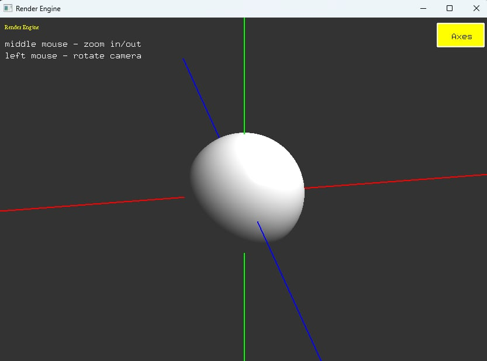
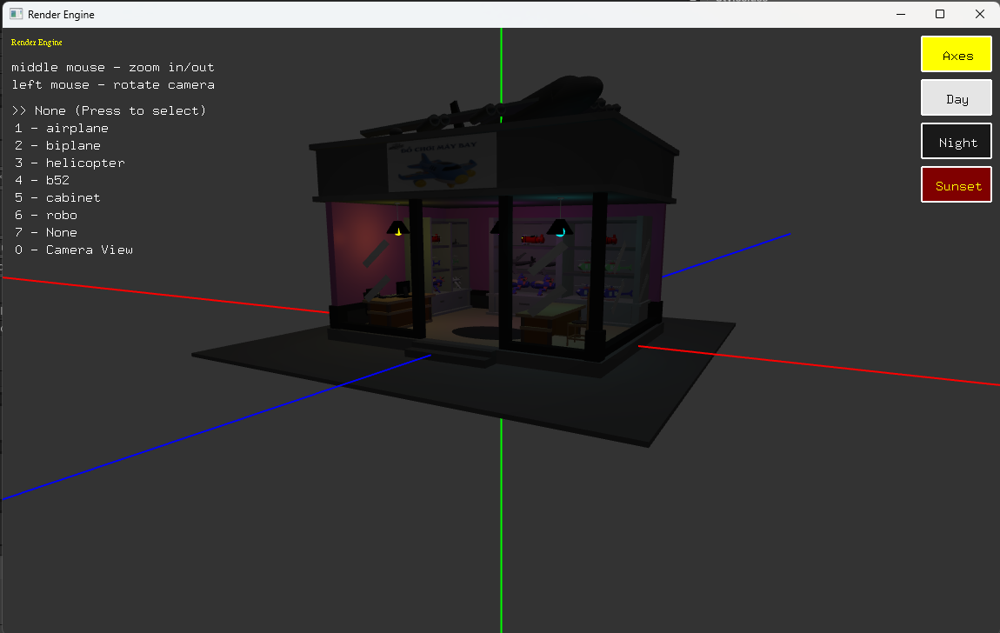

# OpenGL Project Example

<p align="center">
	
</p>

<p align="center">
	<p>Example scene:</p>
	
</p>

best way to lean OpenGL : ```https://learnopengl.com```


## CÁCH TẠO OBJECT MỚI TỪ KHỐI CÓ SẴN

Cách tạo mới 1 object được dựng từ các khối có sẵn

Cần tạo 3 files sau:
- ```object.h``` : header để dùng trong main, thêm vào thư mục ```include/objects```
- ```object.cpp``` : file cpp để code object, thêm vào thư mục ```objects```

```object.h``` để định nghĩa object này

```C++
#pragma once

// include opengl utils
#include "core/openGL.h"

// include file cube để dùng cube, ngoài ra include thêm các object khác nếu có
#include "cube.h"

// định nghĩa hàm draw object
void drawObject(vec3 position, vec3 rotation, vec3 scale);
```

```object.cpp``` để vẽ object

ví dụ vẽ 1 khối cube

```C++
// include file object.h
#include "objects/object.h"

// ví dụ draw cube
void drawObject(vec3 position, vec3 rotation, vec3 scale)
{
	// gọi hàm draw cube trong cube,h
	drawCube(vec3(0, 0, 0), vec3(0, 0, 0), vec3(1, 1, 1), color(1, 1, 1, 1));
}
```


Trong hàm ```display()``` ở ```main```, gọi hàm ```drawObject()``` trên để vẽ 

```C++
//include file object đó
#include "objects/object.h" 

//ví dụ hàm display
void display()
{
	glClear(GL_COLOR_BUFFER_BIT | GL_DEPTH_BUFFER_BIT);

	glClearColor(0.2f, 0.2f, 0.2f, 1.0f);

	introScreen();  //ui

	drawAxes();     // truc xyz toa do (envỉonment)


	drawObject(vec3(), vec3(), vec3(1, 1, 1));  //goi ham draw object do do day


	glEnable(GL_DEPTH_TEST);

	glutSwapBuffers();
}
```

Trong hàm draw, để dùng mô hình phân cấp thì dựa vào hàm ```cubeTransform``` và ```cubeTransformMatrix```
để xác định matrix ở cấp hiện tại

```C++
void drawShelf(vec3 position, vec3 rotation, vec3 scale)
{
	//ap dung pos, rot, scale cho cube, tra ve global model matrix
	mat4 globalTransformMatrix = cubeTransform(position, rotation, scale);

	drawCube(vec3(), vec3(), vec3(1, 1, 1), color(1, 1, 1, 1));


	//mo hinh phan cap, goi ham nay de thay doi transform cho nhung cube sau
	//tra ve current model matrix
	mat4 currentModelMatrix = cubeTransformMatrix(globalTransformMatrix * Angel::Scale(2) * Angel::RotateY(100));

	drawCube(vec3(1, 1, 1), vec3(), vec3(.2, .2, 3), color(1, 1, 1, 1));

	//cube sau la con cua cube truoc (3cap) nen lay current model matrix
	mat4 childModelMatrix = cubeTransformMatrix(currentModelMatrix * Angel::RotateY(50));

	drawCube(vec3(1, 0, 1), vec3(), vec3(1, 1, 3), color(1, 1, 1, 1));

	//tro ve cap 2
	//cubeTransformMatrix(currentModelMatrix);
	// tro ve cap 1
	//cubeTransformMatrix(globalTransformMatrix);

	//reset cube neu ko se bi loi khi draw nhieu objects khac
	cubeReset();
}
```

Để thêm input cho hàm trên, ta thêm biến position và hàm input

```C++
//dung cho input
vec3 cube_position;


void drawShelf(vec3 position, vec3 rotation, vec3 scale)
{
	//ap dung pos, rot, scale cho cube, tra ve global model matrix
	position += cube_position;	//cong them cube input

	//đoạn code dưới y như hàm ở trên
	mat4 globalTransformMatrix = cubeTransform(position, rotation, scale);
	drawCube(vec3(), vec3(), vec3(1, 1, 1), color(1, 1, 1, 1));

	mat4 currentModelMatrix = cubeTransformMatrix(globalTransformMatrix * Angel::Scale(2) * Angel::RotateY(100));
	drawCube(vec3(1, 1, 1), vec3(), vec3(.2, .2, 3), color(1, 1, 1, 1));

	mat4 childModelMatrix = cubeTransformMatrix(currentModelMatrix * Angel::RotateY(50));
	drawCube(vec3(1, 0, 1), vec3(), vec3(1, 1, 3), color(1, 1, 1, 1));

	cubeReset();
}

//nhớ phải gọi hàm này trong hàm input =)
void shelfKeyboard(unsigned char key, int mouseX, int mouseY)
{
	switch (key)
	{
	case 'a':
		cube_position.x -= 0.1f;
		break;
	default:
		break;
	}
}
```


## CÁCH TẠO MỘT OBJECT MỚI

Để tạo object mới thì cần xác định 

xem ví dụ file ```cube.h ```, ``cube.cpp`` để làm

```cube.h``` file header phải đặt trong folder ```include```
[cube.h](https://github.com/hieki-chan/openGL-sample/blob/master/render-engine/include/objects/cube.h)

``cube.cpp`` file header nên đặt trong folder ```objects```
[cube.cpp](https://github.com/hieki-chan/openGL-sample/blob/master/render-engine/objects/cube/cube.cpp)


# CORE

core in render engine

## DEFAULT CUBE

```C++
// dùng cube: core/cube.h
include "objects/cube.h"
```

```C++
// vẽ 1 cube tại position với góc xoay rotation tỉ lệ scale và màu color
// color là typedef vec4
void drawCube(vec3 position, vec3 rotation, vec3 scale, color color);
```

## CAMERA

#### Camera view and Projection

```C++
// camera định nghĩa trong header core/camera.h, triển khai trong core/camera.cpp
include "core/camera.h"
```

```C++
// chuyển sang tọa độ camera và dùng phép chiếu perspective 
// view và projection location từ shader program, gọi hàm này trước khi draw object
void useCameraMatrix(GLuint view_location, GLuint projection_location);
```

#### Camera position

```C++
// thay đổi tọa độ camera (eye)
void setCameraPos(const vec4& position);
```

#### Zoom in/out

```C++
// zoom camera, value > 0 thì phóng to, value < 0 thì thu nhỏ, value = 0 thì không đổi
void zoomCamera(float value);
```

```C++
// set tốc độ zoom
void setZoomSpeed(float zoomSpeed);
```

#### Camera Motion

```C++
// chuyển động của camera xoay quanh gốc tọa độ khi di chuyển chuột
void cameraMotion(int mouseX, int mouseY, int& lastMouseX, int& lastMouseY);
```

## INPUT

> Not supported

## ENVIRONMENT

```C++
//init environment
initEnvironment();
//gọi trong hàm display để vẽ trục xyz
drawAxes();
```

## LIGHTING

#### Create a new light
```C++
// tao 1 light moi va them vao lighting list
light addLight(const vec3& position, const color3& color);
```

## UI

#### Init UI
```C++
// gọi hàm mỗi khi thay đổi window width và window height
void ui::screenChange(int width, int height);
```

#### Render Text
```C++
// vẽ text với tại tọa độ màn (x,y)
void text2D(const char* text, int fontSize, int x, int y, color color = Angel::vec4(1, 1, 1, 1));
```

#### Render Button
```C++
// tạo button
button button2D(const char* text, int fontSize, int sizeX, int sizeY, int x, int y, color buttonColor = Angel::vec4(0, 0, 1, 1), color textColor = Angel::vec4(1, 1, 1, 1));
```

#### Render text and button example

```C++
void onGUI()
{
	ui::text2D("Render Engine", 10, 10, ui::window_height - 20, color(1, 1, 0, 1));

	btnAxes = ui::button2D("Axes", 14, 80, 40, ui::window_width - 90, ui::window_height - 50, color(1, 1, 0, 1), color(0, 0, 0, 1));
	// doSomething se duoc goi neu click trong ham onEvent()
	btnAxes.callback = doSomethingOnClick;
}

void display()
{
	glClear(GL_COLOR_BUFFER_BIT | GL_DEPTH_BUFFER_BIT);
	glClearColor(0.2f, 0.2f, 0.2f, 1.0f);

	// DRAW 3D objects  here

	// ON GUI
	onGUI();


	glEnable(GL_DEPTH_TEST);
	glutSwapBuffers();
}

// sau khi render button, gọi button trong hàm mouse func
void mouse(int button, int state, int x, int y)
{
	btnAxes.onEvent(button, state, x, y);
}
```# fanStore
